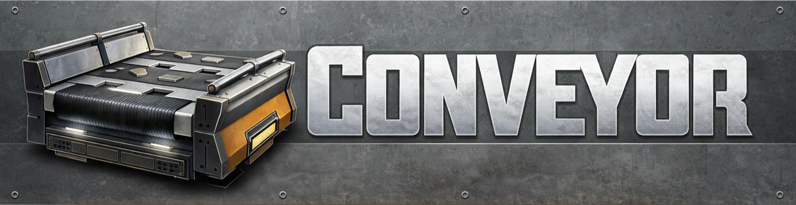

<p align="center">
  
</p>

<p align="center">
  
  
  
  
</p>

A companion app for [Satisfactory](https://www.satisfactorygame.com/). Browse items, look up recipes and their alternates, and sketch out production chains.

Fan project, not affiliated with Coffee Stain Studios.

## Status

Item browser, recipe browser, and a rough production graph work. Factory planning and optimization are the reason I started this, but they aren't built yet.

## Running it

You'll need the [Flutter SDK](https://docs.flutter.dev/get-started/install) (Dart `^3.9.2`).

```bash
flutter pub get
flutter run
```

Builds to iOS, Android, web, macOS, Windows, and Linux via `flutter build <platform>`. I mostly develop against the iOS simulator, so the other platforms may have rough edges.

```bash
flutter analyze
flutter test
dart format .
```

## Game assets

All item/building/recipe data in `assets/data/` and icons in `assets/images/` come from Satisfactory and belong to Coffee Stain Studios. I don't own any of it — it's here so the app is useful. If anyone from Coffee Stain wants something removed, open an issue and I'll take it down.

## License

Code is MIT (see [`LICENSE`](./LICENSE)). That license covers the source only, not the game assets under `assets/`.
